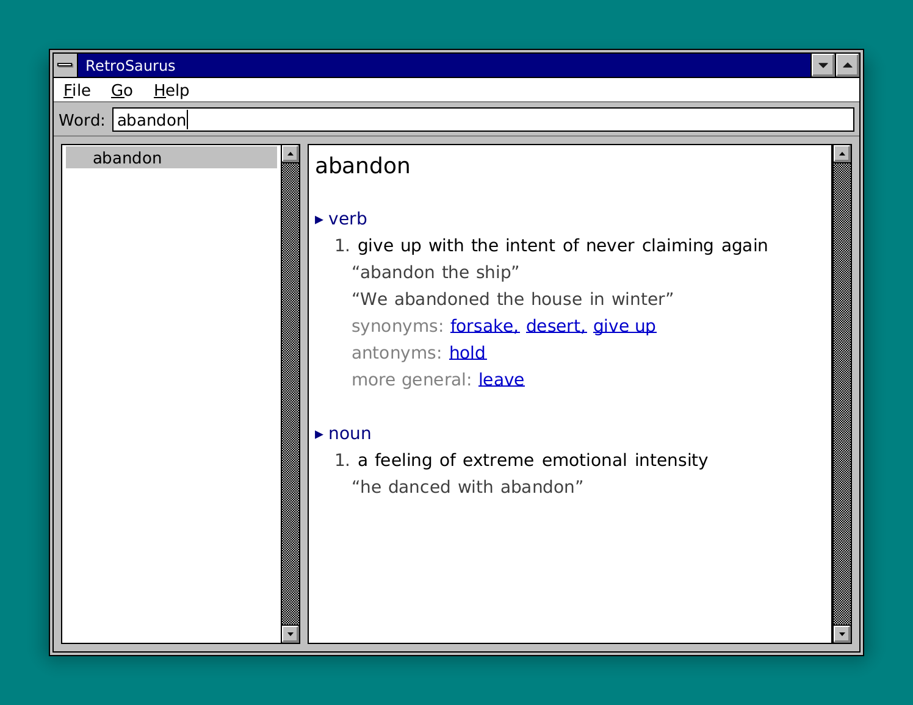

# RetroSaurus

A retro **Windows 3.1-styled thesaurus and dictionary** for your desktop —
classic macOS Dictionary.app, reimagined with the chrome of 1992. It ships the
[Open English WordNet][oewn] baked right into the binary, so it works fully
offline with zero setup.

<p align="center">
  
</p>

Built in Rust on the [Saudade][saudade] toolkit, alongside its siblings
[RetroCalc][retrocalc] and [Git Journey][gitj].

## Features

- **135,969 words** with definitions, examples, synonyms, antonyms and related
  words — every sense grouped by part of speech.
- **Live prefix search** as you type, backed by a finite-state-transducer index.
- **Clickable cross-references** — jump from a synonym straight to its entry,
  with **Back / Forward** history (browser style).
- **Fully offline** — the whole word index (~15 MB) is embedded in the
  executable. No data files, no network, no setup.
- **Keyboard-driven** and resizable, with authentic Win 3.1 chrome.

## Install

```sh
cargo install retrosaurus
```

The first build downloads the WordNet source (~11 MB) once and compiles it into
a compact index baked into the binary. See [Building](#building-from-source).

## Run

```sh
retrosaurus
```

Type a word, pick a sense from the right-hand pane, and click any underlined
word to follow it.

### Keyboard

| Key            | Action                          |
| -------------- | ------------------------------- |
| `Ctrl+F`       | Focus the search field          |
| `↑` / `↓`      | Move the selection / scroll     |
| `Alt+←`        | Back                            |
| `Alt+→`        | Forward                         |
| `Ctrl+R`       | Random word                     |
| `Tab`          | Cycle search → list → definition|
| `Ctrl+Q`       | Quit                            |

## Building from source

```sh
git clone https://github.com/roblillack/retrosaurus
cd retrosaurus
cargo build --release
```

On the **first** build, `build.rs` fetches the Open English WordNet 2025
WN-LMF source from [en-word.net][oewn] (via `curl`/`wget`), verifies its
checksum, and compiles it into `$OUT_DIR/retrosaurus.dat`, which the binary
embeds. To build **offline** or in CI, point it at a local copy instead:

```sh
RETROSAURUS_WORDNET_XML=/path/to/english-wordnet-2025.xml.gz cargo build --release
```

Regenerate the README screenshot with:

```sh
cargo run --example screenshots
```

## Word data & license

RetroSaurus's code is licensed under the [MIT License](LICENSE).

The bundled word data is the **Open English WordNet 2025**, © the Open English
WordNet community, distributed under the
[Creative Commons Attribution 4.0 License][ccby]. RetroSaurus redistributes it
unmodified in a compact binary index; the attribution also appears in the app's
**Help ▸ About** dialog.

[oewn]: https://en-word.net
[saudade]: https://github.com/roblillack/saudade
[retrocalc]: https://github.com/roblillack/retrocalc
[gitj]: https://github.com/roblillack/gitj
[ccby]: https://creativecommons.org/licenses/by/4.0/
